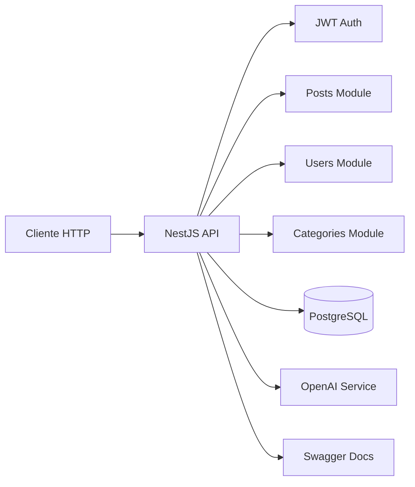
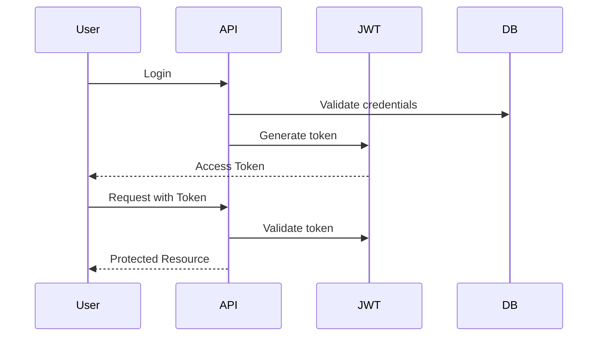
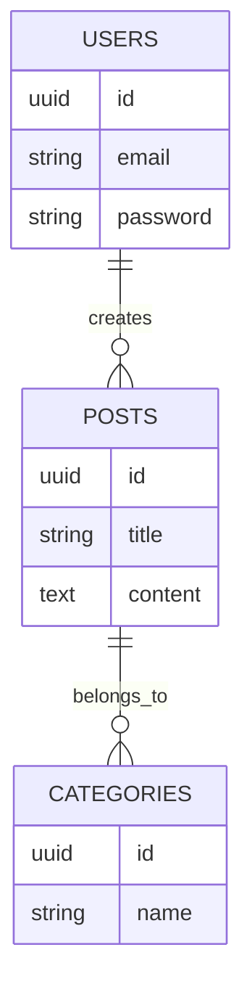

<p align="center">
  <a href="http://nestjs.com/" target="blank"></a>
</p>

[circleci-image]: https://img.shields.io/circleci/build/github/nestjs/nest/master?token=abc123def456
[circleci-url]: https://circleci.com/gh/nestjs/nest

  <p align="center">A progressive <a href="http://nodejs.org" target="_blank">Node.js</a> framework for building efficient and scalable server-side applications.</p>
    <p align="center">
<a href="https://www.npmjs.com/~nestjscore" target="_blank"></a>
<a href="https://www.npmjs.com/~nestjscore" target="_blank"></a>
<a href="https://www.npmjs.com/~nestjscore" target="_blank"></a>
<a href="https://circleci.com/gh/nestjs/nest" target="_blank"></a>
<a href="https://discord.gg/G7Qnnhy" target="_blank"></a>
<a href="https://opencollective.com/nest#backer" target="_blank"></a>
<a href="https://opencollective.com/nest#sponsor" target="_blank"></a>
  <a href="https://paypal.me/kamilmysliwiec" target="_blank"></a>
    <a href="https://opencollective.com/nest#sponsor"  target="_blank"></a>
  <a href="https://twitter.com/nestframework" target="_blank"></a>
</p>
  <!--[](https://opencollective.com/nest#backer)
  [](https://opencollective.com/nest#sponsor)-->

## Description

[Nest](https://github.com/nestjs/nest) framework TypeScript starter repository.

## Project setup

```bash
$ npm install
```

## Compile and run the project

```bash
# development
$ npm run start

# watch mode
$ npm run start:dev

# production mode
$ npm run start:prod
```

## Run tests

```bash
# unit tests
$ npm run test

# e2e tests
$ npm run test:e2e

# test coverage
$ npm run test:cov
```


---

## Arquitectura General



---

## Stack Tecnológico

| Tecnología                                                                                                          | Propósito                              |
| ------------------------------------------------------------------------------------------------------------------- | -------------------------------------- |
|  **NestJS**                                            | Framework backend modular y escalable  |
|  **PostgreSQL**                | Base de datos relacional               |
|  **TypeORM** | ORM para integración con PostgreSQL    |
|  **JSON Web Token**                                          | Autenticación basada en tokens         |
|  **Swagger**                 | Documentación interactiva de API       |
|  **OpenAI**     | Generación de contenido con IA         |
|  **Docker**                  | Contenerización y entorno reproducible |

---

## Evolución Funcional

### 1. Base del Proyecto

* Configuración inicial del entorno.
* Estructura modular.
* Configuración de ESLint, Prettier y TypeScript.
* Soporte para variables de entorno.

---

### 2. Gestión de Usuarios

* Implementación completa de CRUD.
* Validaciones con DTO.
* Hash de contraseñas con bcrypt.
* Serialización de respuestas.
* Integración con base de datos relacional.

---

### 3. Persistencia y Migraciones

* Integración con PostgreSQL.
* Configuración de TypeORM.
* Scripts de migración.
* Docker Compose para entorno local.

---

### 4. Publicaciones y Categorías

* Relaciones entre entidades.
* Asociación de usuarios con publicaciones.
* Integración bidireccional de categorías.
* Servicios desacoplados por módulo.

---

### 5. Seguridad

* Implementación de autenticación JWT.
* Estrategia Passport.
* Protección de endpoints.
* Validación global.
* Refuerzo de cabeceras HTTP con Helmet.
* Separación de payload tipado.



---

### 6. Documentación y Estándares

* Integración de Swagger.
* Estandarización de DTO.
* Validaciones centralizadas.
* Serialización consistente.

---

### 7. Integración con Inteligencia Artificial

* Implementación de módulo AI.
* Servicio para generación de contenido dinámico.
* Integración desacoplada mediante proveedor dedicado.

---

### 8. Optimización y Producción

* Scripts de compilación para producción.
* Configuración segura de entorno.
* Mejora de cabeceras HTTP.
* Preparación para despliegue escalable.

---

## Modelo Relacional Simplificado



---
